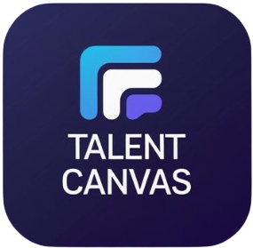

# TalentCanvas



TalentCanvas is an AI-powered tech recruitment platform that revolutionizes the way tech professionals find their dream jobs and companies discover top talent. Our platform combines cutting-edge AI technology with intuitive design to create meaningful connections in the tech industry.

## 🚀 Features

### For Candidates

- **AI-Powered Job Matching**: Get matched with roles that perfectly fit your skills and career goals
- **Personal Dashboard**: Track applications, view feedback, and manage your profile
- **Skill Assessment**: Take assessments to showcase your expertise
- **Career Advice**: Access personalized career guidance and insights
- **Real-time Notifications**: Stay updated on application status and new opportunities

### For Employers

- **Advanced Candidate Search**: Find candidates using AI-powered filters and matching algorithms
- **Employer Dashboard**: Manage job postings, track applications, and view analytics
- **Hiring Analytics**: Gain insights into your hiring process and candidate pipeline
- **Feedback System**: Provide actionable feedback to candidates
- **Job Posting Management**: Create, edit, and manage job postings with ease

### Platform Features

- **Responsive Design**: Optimized for desktop, tablet, and mobile devices
- **Real-time Messaging**: Communicate with candidates or employers
- **Secure Authentication**: Robust sign-in and sign-up processes
- **SEO Optimized**: Built with React Helmet for better search engine visibility

## 🛠 Tech Stack

- **Frontend**: React 18, TypeScript, Vite
- **UI Framework**: Tailwind CSS, Shadcn/ui
- **State Management**: React Query (TanStack)
- **Routing**: React Router DOM
- **Icons**: Lucide React
- **Charts**: Recharts
- **Forms**: React Hook Form with Zod validation
- **Animations**: Framer Motion
- **SEO**: React Helmet Async

## 📦 Installation

1. **Clone the repository**

   ```bash
   git clone https://github.com/yourusername/talentcanvas.git
   cd talentcanvas
   ```

2. **Install dependencies**

   ```bash
   npm install
   ```

3. **Start the development server**

   ```bash
   npm run dev
   ```

4. **Build for production**

   ```bash
   npm run build
   ```

5. **Preview production build**
   ```bash
   npm run preview
   ```

## 📁 Project Structure

```
talentcanvas/
├── public/
│   ├── logo.png
│   └── robots.txt
├── src/
│   ├── assets/
│   │   ├── data/
│   │   │   ├── aboutData.ts
│   │   │   ├── indexData.ts
│   │   │   └── onboarding.ts
│   │   └── images/
│   ├── authentication/
│   │   ├── SignIn.tsx
│   │   └── SignUp.tsx
│   ├── components/
│   │   ├── layout/
│   │   │   ├── Header.tsx
│   │   │   └── Footer.tsx
│   │   ├── sections/
│   │   │   ├── home/
│   │   │   │   ├── Features.tsx
│   │   │   │   ├── HowItWorks.tsx
│   │   │   │   └── Testimonials.tsx
│   │   │   └── about/
│   │   │       ├── Mission.tsx
│   │   │       ├── Team.tsx
│   │   │       └── Value.tsx
│   │   └── ui/
│   ├── hooks/
│   ├── lib/
│   │   └── utils.ts
│   ├── pages/
│   │   ├── About.tsx
│   │   ├── CandidateDashboard.tsx
│   │   ├── CandidateSearch.tsx
│   │   ├── CareerAdvice.tsx
│   │   ├── Contact.tsx
│   │   ├── EmployerDashboard.tsx
│   │   ├── HiringAnalytics.tsx
│   │   ├── Index.tsx
│   │   ├── JobPostings.tsx
│   │   ├── JobSearch.tsx
│   │   ├── Messages.tsx
│   │   ├── MyProfile.tsx
│   │   ├── NotFound.tsx
│   │   ├── Onboarding.tsx
│   │   ├── Privacy.tsx
│   │   ├── SalaryInsights.tsx
│   │   ├── SkillAssessment.tsx
│   │   └── Terms.tsx
│   ├── routes/
│   │   └── AppRouter.tsx
│   ├── App.css
│   ├── App.tsx
│   ├── index.css
│   ├── main.tsx
│   └── vite-env.d.ts
├── index.html
├── package.json
├── tailwind.config.ts
├── tsconfig.json
├── vite.config.ts
└── README.md
```

## 🎯 Key Pages

- **Home (Index.tsx)**: Landing page with hero section, features, and testimonials
- **About (About.tsx)**: Company information, mission, values, and team
- **Contact (Contact.tsx)**: Contact form and company information
- **Candidate Dashboard (CandidateDashboard.tsx)**: Personal dashboard for job seekers
- **Employer Dashboard (EmployerDashboard.tsx)**: Management dashboard for employers
- **Job Search (JobSearch.tsx)**: Job listings and search functionality
- **Job Postings (JobPostings.tsx)**: Create and manage job postings
- **Messages (Messages.tsx)**: Real-time messaging system
- **My Profile (MyProfile.tsx)**: User profile management
- **Skill Assessment (SkillAssessment.tsx)**: Technical skill evaluations
- **Career Advice (CareerAdvice.tsx)**: Career guidance and insights
- **Hiring Analytics (HiringAnalytics.tsx)**: Analytics for employers
- **Salary Insights (SalaryInsights.tsx)**: Salary data and insights

## 📜 Available Scripts

- `npm run dev` - Start development server
- `npm run build` - Build for production
- `npm run build:dev` - Build for development
- `npm run lint` - Run ESLint
- `npm run preview` - Preview production build

## 🔧 Configuration

### Environment Variables

Create a `.env` file in the root directory with the following variables:

```env
VITE_API_BASE_URL=https://api.talentcanvas.com
VITE_APP_ENV=development
```

### Tailwind Configuration

The project uses Tailwind CSS with custom configuration in `tailwind.config.ts`. Key customizations include:

- Custom color palette
- Extended spacing and typography
- Custom animations and transitions

## 🎨 Design System

### Colors

- Primary: Blue gradient (#3b82f6 to #1d4ed8)
- Secondary: Gray scale
- Accent: Green for success states

### Typography

- Font Family: Inter (system font stack)
- Headings: Bold, varying sizes
- Body: Regular weight, optimized for readability

### Components

- Built with Shadcn/ui components
- Consistent spacing and styling
- Accessible design patterns

## 🤝 Contributing

1. Fork the repository
2. Create a feature branch (`git checkout -b feature/amazing-feature`)
3. Commit your changes (`git commit -m 'Add some amazing feature'`)
4. Push to the branch (`git push origin feature/amazing-feature`)
5. Open a Pull Request

### Development Guidelines

- Follow TypeScript best practices
- Use meaningful commit messages
- Write clear, concise component documentation
- Ensure responsive design across all devices
- Test components thoroughly before submitting PRs

## 📄 License

This project is licensed under the MIT License - see the [LICENSE](LICENSE) file for details.

## 📞 Contact

- **Website**: [https://talentcanvas.com](https://talentcanvas.com)
- **Email**: support@talentcanvas.com
  <!-- - **LinkedIn**: [TalentCanvas](https://linkedin.com/company/talentcanvas) -->
  <!-- - **Twitter**: [@TalentCanvas](https://twitter.com/TalentCanvas) -->

## 🙏 Acknowledgments

- Icons by [Lucide](https://lucide.dev/)
- UI Components by [Shadcn/ui](https://ui.shadcn.com/)
- Charts by [Recharts](https://recharts.org/)
- Animations by [Framer Motion](https://www.framer.com/motion/)

---

**TalentCanvas** - Connecting Tech Talent with Dream Opportunities 🚀
